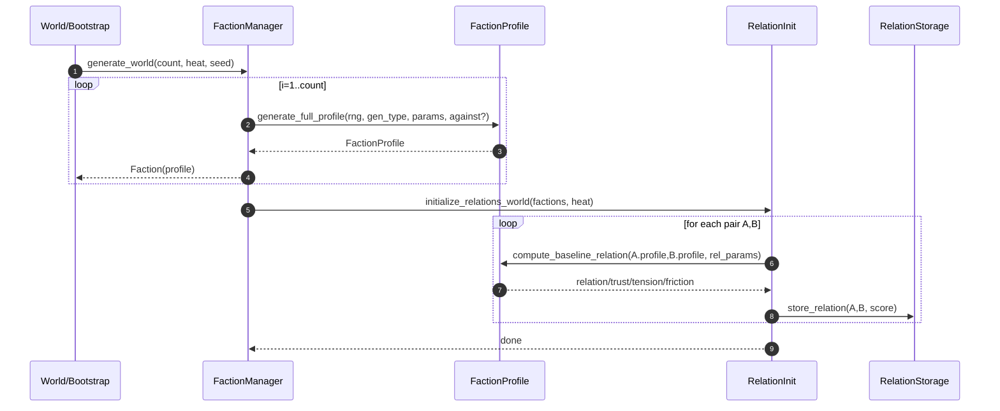
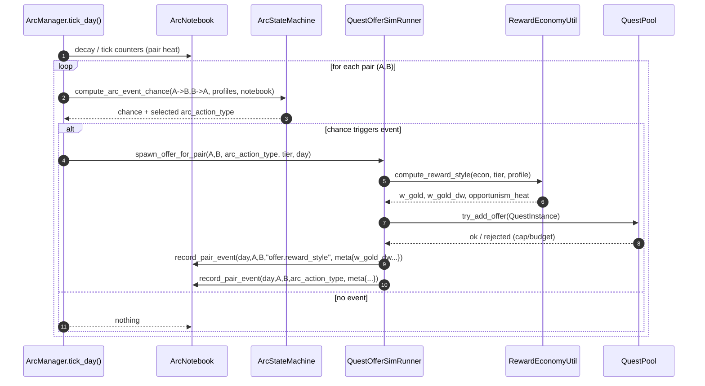
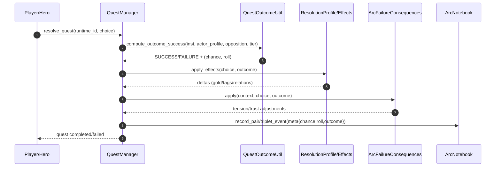

Voici une **documentation fonctionnelle** (format Markdown) du système qu’on a construit autour de :

* **FactionProfile (axes + personnalité)**
* **Relations inter-factions + init “heat”**
* **ArcNotebook / PairHeat (historique & métriques)**
* **Arcs (ArcManager / ArcStateMachine)**
* **Économie narrative des récompenses (gold vs non-gold)**
* **Pont vers QuestOfferSimRunner / QuestPool / QuestManager**
* **Tick journalier (monde)**

J’ai structuré **par domaines fonctionnels**, avec un **sommaire cliquable** et des **diagrammes de séquence Mermaid**.

---

# Documentation fonctionnelle — Système Factions / Relations / Arcs / Économie narrative / Offers

## Sommaire

* [1. Objectif global du système](#1-objectif-global-du-système)
* [2. Domaine Identité de faction](#2-domaine-identité-de-faction)

  * [2.1 Objectifs](#21-objectifs)
  * [2.2 Données et variables](#22-données-et-variables)
  * [2.3 Règles de génération](#23-règles-de-génération)
  * [2.4 Interfaces clés](#24-interfaces-clés)
* [3. Domaine Relations inter-factions](#3-domaine-relations-inter-factions)

  * [3.1 Objectifs](#31-objectifs)
  * [3.2 Données et variables](#32-données-et-variables)
  * [3.3 Règles de gestion](#33-règles-de-gestion)
  * [3.4 Initialisation “monde” + paramètre Heat](#34-initialisation-monde--paramètre-heat)
* [4. Domaine Historique & métriques](#4-domaine-historique--métriques)

  * [4.1 Objectifs](#41-objectifs)
  * [4.2 Données et variables](#42-données-et-variables)
  * [4.3 Règles de gestion](#43-règles-de-gestion)
* [5. Domaine Arcs et machine d’état](#5-domaine-arcs-et-machine-détat)

  * [5.1 Objectifs](#51-objectifs)
  * [5.2 ArcState et transitions](#52-arcstate-et-transitions)
  * [5.3 Actions d’arc et anti-boucles](#53-actions-darc-et-anti-boucles)
  * [5.4 Fin d’arc + pair lock](#54-fin-darc--pair-lock)
* [6. Domaine Économie narrative & rareté](#6-domaine-économie-narrative--rareté)

  * [6.1 Objectifs](#61-objectifs)
  * [6.2 Données et variables](#62-données-et-variables)
  * [6.3 Règles de gestion](#63-règles-de-gestion)
* [7. Domaine Offers de quêtes et intégration Quest System](#7-domaine-offers-de-quêtes-et-intégration-quest-system)

  * [7.1 Objectifs](#71-objectifs)
  * [7.2 Contexte standard d’une offer](#72-contexte-standard-dune-offer)
  * [7.3 Mapping arc_action_type → offers](#73-mapping-arc_action_type--offers)
  * [7.4 Résolution des quêtes et conséquences monde](#74-résolution-des-quêtes-et-conséquences-monde)
* [8. Processus Journalier](#8-processus-journalier)
* [9. Diagrammes de séquence](#9-diagrammes-de-séquence)

  * [9.1 Génération du monde](#91-génération-du-monde)
  * [9.2 Tick journalier arcs → offers](#92-tick-journalier-arcs--offers)
  * [9.3 Résolution d’une quête (2 ou 3 factions)](#93-résolution-dune-quête-2-ou-3-factions)
* [10. Suggestions d’améliorations à ajouter](#10-suggestions-daméliorations-à-ajouter)
* [Annexe A — Listes de clés et conventions](#annexe-a--listes-de-clés-et-conventions)

---

## 1. Objectif global du système

Le système vise à générer un **monde vivant** où :

* les **factions** ont une identité (axes + personnalité),
* leurs **relations** évoluent avec l’historique (hostilité, diplomatie, opportunisme),
* des **arcs** émergent (rivalité, trêve, alliance, guerre…) sans boucler en escalade infinie,
* les factions produisent des **offers de quêtes** cohérentes (combat, diplomatie, sabotage, médiation…),
* l’économie se “raconte” via des récompenses **monétaires et non monétaires** (faveurs, accès, traités, influence, artefacts),
* et tout est **observable** (ArcNotebook/heat) + testable (tests statistiques et d’intégration).

---

## 2. Domaine Identité de faction

### 2.1 Objectifs

* Définir une identité de faction **data-driven** :

  * **Axes d’affinité** (Tech/Magie/Nature/Divin/Corruption).
  * **Traits de personnalité** (multiplicateurs influençant relations, arc-chance, coût/choix d’actions, etc.).
* Permettre :

  * génération procédurale (modes “normal/centered/dramatic”),
  * génération antagoniste (contre axe ou contre faction dominante),
  * paramètre global “heat” pour rendre le monde plus conflictuel.

### 2.2 Données et variables

**FactionProfile**

* `axis_affinity: Dictionary[StringName, int]`

  * échelle `[-100..+100]`
  * clés axes (ex) :

    * `axis.tech`
    * `axis.magic`
    * `axis.nature`
    * `axis.divine`
    * `axis.corruption`
* `personality: Dictionary[StringName, float]`

  * échelle `[0..1]`
  * clés (selon ton fichier actuel) :

    * `pers.aggression`
    * `pers.vengefulness`
    * `pers.diplomacy`
    * `pers.risk_aversion`
    * `pers.expansionism`
    * `pers.integrationism`
  * NB : tu peux aussi ajouter des clés “libres” (greed/honor/discipline/opportunism) si tu veux enrichir l’économie ; le stockage en dictionnaire le permet.

### 2.3 Règles de génération

Règles minimales garanties sur `axis_affinity` :

* Au moins **1 axe > +50**
* Au moins **1 axe < -20**
* Somme des axes dans **[20..90]**
* Distribution non triviale (pas juste “1 gros +, 1 petit -, reste 0”)

Modes de génération :

* `GEN_CENTERED` : profils nuancés / moins extrêmes.
* `GEN_NORMAL` : variété standard.
* `GEN_DRAMATIC` : profils radicaux / contrastés.

Mode antagoniste :

* contre un axe (ex: anti-magie)
* ou contre le profil d’une faction dominante (anti-hégémonie)

### 2.4 Interfaces clés

* `FactionProfile.generate_axis_affinity(rng, gen_type, params={}, force_against_axis=&"", against_profile=null, antagonism_strength=1.0)`
* `FactionProfile.generate_personality(rng, params={})`
* `FactionProfile.generate_full_profile(rng, gen_type, params={}, force_against_axis=&"", against_profile=null, antagonism_strength=1.0)`

---

## 3. Domaine Relations inter-factions

### 3.1 Objectifs

* Initialiser et faire évoluer une relation **A→B** (asymétrique) :

  * relation globale, confiance, tension, grievance, fatigue, friction.
* Produire des métriques qui alimentent :

  * **probabilités d’incident** (arc events),
  * **choix d’action** (raid / truce / ultimatum…),
  * **fin d’arcs** (apaisement/alignement),
  * **budget et coût** (capacité à payer et à mener un conflit).

### 3.2 Données et variables

**FactionRelationScore** (A→B)

* `relation: int` `[-100..+100]`
* `trust: int` `[-100..+100]`
* `tension: float` `[0..100]`
* `grievance: float` `[0..100]`
* `weariness: float` `[0..100]`
* `friction: float` `[0..1]` (tendance structurelle au conflit)
* * champs optionnels : `last_update_day`, `cooldowns`, etc.

### 3.3 Règles de gestion

* **Asymétrie** : A→B et B→A ne sont pas identiques.
* **Évolution bornée** par événement :

  * variation max liée à l’historique (règle “10 à 30%” du score courant selon ArcNotebook).
* **Décroissance** de certains termes :

  * tension/grievance se dissipent sans événements (selon decay).
* **Réciprocité légère** (optionnelle à l’init monde) :

  * A→B et B→A convergent à ~70% sans être identiques.

### 3.4 Initialisation “monde” + paramètre Heat

Objectif : générer une matrice cohérente de relations de départ, réglée par une **chaleur globale** `heat ∈ [1..100]`.

Effets de `heat` :

* plus `heat` est élevé :

  * profils plus “dramatiques”
  * friction/tension de base plus fortes
  * davantage d’ennemis “naturels”
* plus `heat` est faible :

  * monde plus nuancé, incidents plus rares

Processus (résumé) :

1. calcul brut via `compute_baseline_relation(A_profile, B_profile, params)`
2. centrage des moyennes sortantes (moyenne relation par faction ≈ 0)
3. injection de quelques extrêmes (ennemis/allies)
4. réciprocité légère

**Important** : tu as indiqué que tu as **déjà** une façon de stocker les relations → la phase “commit” doit utiliser **ton stockage existant** (set_relation_score / store manager / etc.).

---

## 4. Domaine Historique & métriques

### 4.1 Objectifs

* Garder un historique exploitable pour :

  * stabiliser le système (anti-escalade mécanique),
  * générer des comportements cohérents (“ils se sont sabotés 5 fois”),
  * debug/metrics (“pourquoi incident?” “pourquoi cette récompense?”).

### 4.2 Données et variables

**ArcNotebook**

* `pair_events[]` : log d’événements (jour, A, B, action, choice, meta)
* `pair_history` / `ArcHistory` : compteurs par type, dates, arcs résolus…
* `pair_heat_by_key` : structure de heat par paire

**PairHeat**

* compteurs hostiles/pacifiques (directionnels AB/BA)
* decay temporel
* “contributions” (selon implémentation)

### 4.3 Règles de gestion

* `record_pair_event(day, a, b, action, choice, meta)` :

  * enregistre l’événement
  * met à jour l’historique
  * applique un delta de heat via `_action_heat_delta(action)`
* Les actions pacifiques peuvent **réduire** la heat.
* Les actions hostiles augmentent plus ou moins la heat selon gravité.

---

## 5. Domaine Arcs et machine d’état

### 5.1 Objectifs

* Déclencher et faire évoluer des arcs (RIVALRY/WAR/TRUCE/ALLIANCE/FUSION…)
* Éviter les boucles “vengeance → vengeance → escalade infinie”
* Produire des offers de quêtes cohérentes (actions d’arc → templates + context)

### 5.2 ArcState et transitions

**ArcState** (par paire, ou par arc_id)

* `state` (ex: PEACE, RIVALRY, CONFLICT, WAR, TRUCE, ALLIANCE, RESOLVED)
* `stage` (si tu gardes des “stages” internes)
* `tension_mean`, `trust_mean`, `relation_mean` (métriques)
* compteurs “X jours sous seuil” pour conditions de fin
* `pair_lock_until_day` (cooldown long post-résolution)
* `cooldown_by_action_type` (cap anti-spam)

Transitions typiques :

* PEACE → RIVALRY si incident
* RIVALRY → CONFLICT si incidents répétés / tensions élevées
* CONFLICT → WAR si seuil guerre atteint + capacité/budget
* CONFLICT/RIVALRY → TRUCE si fatigue/domestic pressure ou diplomatie réussie
* TRUCE → ALLIANCE si trust/relations montent
* ALLIANCE → FUSION (rare, gated) si alignement élevé + durée + intérêts convergents
* n’importe quel état → RESOLVED si fin + lock

### 5.3 Actions d’arc et anti-boucles

* `compute_arc_event_chance(A→B, B→A, profiles, notebook)` calcule la probabilité d’incident
* table de sélection `arc_action_type` (raid/ultimatum/truce/reparations/alliance…)

Anti-boucles :

* cooldown par action type
* limitation du nombre d’offres par faction/pair
* fallback si action trop chère :

  * ultimatum → raid → ignore (et/ou tier--)
* cap d’évolution par événement (10–30% rule liée au notebook)

### 5.4 Fin d’arc + pair lock

Conditions de fin recommandées (exemples) :

* Rivalité se termine si `tension_mean < X` pendant `Y jours`
* ou si `trust_mean > X` et `relation_mean > X`
* si WAR déclarée → certains arcs mineurs stoppés / fusionnés dans WAR

**pair_lock_days** :

* après un arc majeur (trêve/alliance/fusion), verrouille la paire 15–40 jours
* empêche de rerentrer immédiatement en incident

---

## 6. Domaine Économie narrative & rareté

### 6.1 Objectifs

* Le monde raconte l’économie :

  * factions pauvres → “paiement” en faveurs / accès / traités / influence
  * factions riches → payent plus en or, mais attirent opportunistes (heat opportunism)
* Contrôler l’inflation narrative :

  * rareté (tokens de concession)
  * variance bornée
  * tests statistiques de stabilité

### 6.2 Données et variables

**FactionEconomyState** (ou équivalent)

* `wealth_level` (POOR/MODEST/RICH/OPULENT)
* `liquidity` `[0..1]`
* `prestige` `[0..1]`
* (optionnel) `concession_tokens` (rareté)

**RewardStyle**

* `w_gold_base`
* `w_gold_dw` (delta personnalité)
* `w_gold` final clampé
* `opportunism_heat`

**RewardBundle** (dans le context offer)

* `gold`
* `influence`
* `access[]`
* `treaty_clauses[]`
* `favor_debt`
* `artifact_id`
* `intel_tags[]`
* `opportunism_heat`

### 6.3 Règles de gestion

* `w_gold` dépend de l’économie **et** de la personnalité, avec rails :

  * POOR : `w_gold ≤ 0.35`
  * RICH : `w_gold ≥ 0.60`
* variance de gold pilotée par personnalité (chaos/greedy > bureaucratic), bornée (ex: 4–22%)
* rareté : `concession_tokens` limite les concessions (accès/traité)

---

## 7. Domaine Offers de quêtes et intégration Quest System

### 7.1 Objectifs

* Transformer les décisions “monde” (arcs/économie/third party) en **offers** compatibles QuestPool
* Stocker dans le `context` :

  * la raison de l’offre
  * les participants (2 ou 3 factions)
  * reward_bundle/reward_style
  * deadlines/tier/stakes
* Résoudre les quêtes et appliquer les conséquences (SUCCESS/FAILURE + choice)

### 7.2 Contexte standard d’une offer

Clés recommandées dans `QuestInstance.context` :

* `giver_faction_id`
* `antagonist_faction_id`
* `third_party_id` (optionnel)
* `arc_action_type` (ou `tp_action`)
* `is_arc_*` flags si besoin
* `tier`, `day`, `expires_on_day`
* `reward_bundle`, `reward_style`
* `resolution_profile_id`
* `opposition` (facultatif : pré-calcul de résistance/heat)

### 7.3 Mapping arc_action_type → offers

Exemples :

* `arc.raid` → combat / sabotage / supply-line
* `arc.ultimatum` → diplomacy / escort envoy / retrieve proof
* `arc.truce_talks` → escort diplomat / secure venue / eliminate spoiler
* `arc.alliance_offer` → joint mission / oath ritual / exchange hostages

### 7.4 Résolution des quêtes et conséquences monde

Pipeline :

* `QuestManager.resolve_quest(runtime_id, choice)` :

  * compute outcome (SUCCESS/FAILURE) via `compute_outcome_success` (roll forcé possible)
  * applique effects “success/failure + choice”
  * appelle des conséquences monde (ex: tension/trust changes)
  * log ArcNotebook (`chance`, `roll`, `outcome`)

---

## 8. Processus Journalier

Le tick journalier peut orchestrer :

* decay des métriques (tension/grievance/heat)
* opportunités (rich opportunism)
* sélection d’actions d’arc
* spawn d’offres via `QuestOfferSimRunner`
* enregistrement dans ArcNotebook

---

## 9. Diagrammes de séquence

> Les diagrammes Mermaid sont lisibles dans les viewers qui supportent Mermaid (GitHub, GitLab, certaines docs tools).

### 9.1 Génération du monde

### 9.2 Tick journalier arcs → offers

### 9.3 Résolution d’une quête (2 ou 3 factions)

---

## 10. Suggestions d’améliorations à ajouter

En plus de la persistance et de la stabilité métrique, voici les ajouts les plus “rentables” fonctionnellement :

1. **Configuration data-driven** (fichiers `.tres` ou JSON)

   * poids de relation (w_axis_similarity, friction_base…)
   * tables d’actions par state
   * mapping action → templates d’offres
   * avantages : tuning sans toucher au code, équilibrage rapide

2. **Outil de debug / observabilité**

   * UI debug “Why offer spawned?” (chance, roll, cooldown, budget, w_gold_dw)
   * export CSV des events (tu l’as déjà commencé côté tests)

3. **Politique de remplacement d’offres**

   * si pool saturé, remplacer une “mauvaise” offer par une meilleure (même paire, meilleur tier, stake plus clair)
   * évite les pools “bloqués”

4. **Règles d’opportunisme plus visibles**

   * rich attracts opportunists → offres “heist/embezzle/blackmail”
   * * rumeurs (knowledge) pour expliquer le monde au joueur

5. **Clauses/traités minimalistes mais persistants**

   * même sans un système complet : un Treaty “léger” stabilise les sorties de guerre

6. **Interop Goals ↔ Arcs ↔ Economy**

   * un goal commerce/stabilité remonte liquidity/prestige ⇒ modifie rewards et w_gold
   * la guerre augmente weariness ⇒ pousse trêve/reparations (sortie organique)

---

## Annexe A — Listes de clés et conventions

### A.1 Axes (StringName)

* `axis.tech`
* `axis.magic`
* `axis.nature`
* `axis.divine`
* `axis.corruption`

### A.2 Personnalité (StringName) — base actuelle

* `pers.aggression`
* `pers.vengefulness`
* `pers.diplomacy`
* `pers.risk_aversion`
* `pers.expansionism`
* `pers.integrationism`

### A.3 Exemples de clés “libres” (si tu enrichis)

* `pers.greed`
* `pers.honor`
* `pers.discipline`
* `pers.opportunism`
  (ou les garder hors namespace `pers.*` si tu préfères, mais le namespace aide beaucoup)

### A.4 Actions d’arc (ex)

* `arc.raid`
* `arc.sabotage`
* `arc.ultimatum`
* `arc.declare_war`
* `arc.truce_talks`
* `arc.reparations`
* `arc.alliance_offer`

---

Si tu veux, je peux aussi te fournir :

* une version “prête à publier” (ton plus narratif, moins technique),
* ou une version orientée “spécifications” (tables exhaustives, seuils, paramètres, champs exacts de context).
