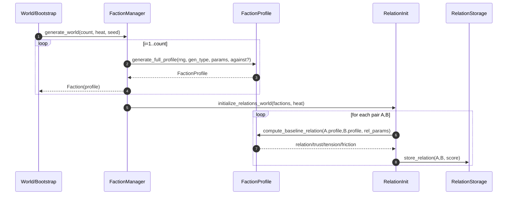
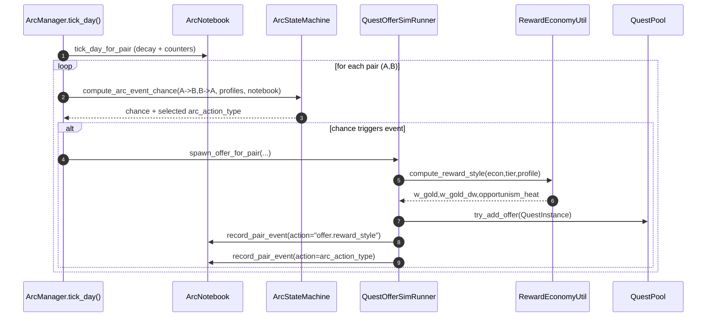

# Documentation fonctionnelle — Système Factions / Relations / Arcs / Économie narrative / Offers

> Version “prête à livrer” (Markdown).  
> Contient : **sommaire cliquable**, descriptions fonctionnelles des données, explications narrativisées par domaine, règles, diagrammes de séquence, et un chapitre **Design Doc** (exemples d’offres par état + mini-scénarios).

---

## Sommaire

- [1. Objectif global du système](#1-objectif-global-du-système)
- [2. Domaine Identité de faction](#2-domaine-identité-de-faction)
  - [2.1 Vision narrative](#21-vision-narrative)
  - [2.2 Objectifs fonctionnels](#22-objectifs-fonctionnels)
  - [2.3 Données fonctionnelles](#23-données-fonctionnelles)
  - [2.4 Règles de génération](#24-règles-de-génération)
  - [2.5 Interfaces clés](#25-interfaces-clés)
- [3. Domaine Relations inter-factions](#3-domaine-relations-inter-factions)
  - [3.1 Vision narrative](#31-vision-narrative)
  - [3.2 Objectifs fonctionnels](#32-objectifs-fonctionnels)
  - [3.3 Données fonctionnelles](#33-données-fonctionnelles)
  - [3.4 Règles de gestion](#34-règles-de-gestion)
  - [3.5 Initialisation “monde” + paramètre Heat](#35-initialisation-monde--paramètre-heat)
- [4. Domaine Historique & métriques](#4-domaine-historique--métriques)
  - [4.1 Vision narrative](#41-vision-narrative)
  - [4.2 Objectifs fonctionnels](#42-objectifs-fonctionnels)
  - [4.3 Données fonctionnelles](#43-données-fonctionnelles)
  - [4.4 Règles de gestion](#44-règles-de-gestion)
- [5. Domaine Arcs et machine d’état](#5-domaine-arcs-et-machine-détat)
  - [5.1 Vision narrative](#51-vision-narrative)
  - [5.2 Objectifs fonctionnels](#52-objectifs-fonctionnels)
  - [5.3 ArcState et transitions](#53-arcstate-et-transitions)
  - [5.4 Actions d’arc et anti-boucles](#54-actions-darc-et-anti-boucles)
  - [5.5 Fin d’arc + pair lock](#55-fin-darc--pair-lock)
- [6. Domaine Économie narrative & rareté](#6-domaine-économie-narrative--rareté)
  - [6.1 Vision narrative](#61-vision-narrative)
  - [6.2 Objectifs fonctionnels](#62-objectifs-fonctionnels)
  - [6.3 Données fonctionnelles](#63-données-fonctionnelles)
  - [6.4 Règles de gestion](#64-règles-de-gestion)
- [7. Domaine Offers & intégration Quest System](#7-domaine-offers--intégration-quest-system)
  - [7.1 Vision narrative](#71-vision-narrative)
  - [7.2 Objectifs fonctionnels](#72-objectifs-fonctionnels)
  - [7.3 Contexte standard d’une offer](#73-contexte-standard-dune-offer)
  - [7.4 Mapping arc_action_type → offers](#74-mapping-arc_action_type--offers)
  - [7.5 Résolution, outcome et conséquences monde](#75-résolution-outcome-et-conséquences-monde)
- [8. Processus journalier](#8-processus-journalier)
- [9. Diagrammes de séquence](#9-diagrammes-de-séquence)
  - [9.1 Génération du monde](#91-génération-du-monde)
  - [9.2 Tick journalier arcs → offers](#92-tick-journalier-arcs--offers)
  - [9.3 Résolution d’une quête 2 ou 3 factions](#93-résolution-dune-quête-2-ou-3-factions)
- [10. Spécifications](#10-spécifications)
  - [10.1 Liste exhaustive des axes & conventions](#101-liste-exhaustive-des-axes--conventions)
  - [10.2 Liste exhaustive des traits personnalité](#102-liste-exhaustive-des-traits-personnalité)
  - [10.3 Paramètres globaux “Heat”](#103-paramètres-globaux-heat)
  - [10.4 Seuils recommandés pour états d’arc](#104-seuils-recommandés-pour-états-darc)
  - [10.5 Table action → heat delta](#105-table-action--heat-delta)
  - [10.6 Table action → cooldown / budget / bundle](#106-table-action--cooldown--budget--bundle)
  - [10.7 Champs exacts du context QuestInstance](#107-champs-exacts-du-context-questinstance)
  - [10.8 Format RewardBundle & RewardStyle](#108-format-rewardbundle--rewardstyle)
  - [10.9 Bornes & règles d’évolution des relations](#109-bornes--règles-dévolution-des-relations)
- [11. Design Doc — Exemples d’offres et mini-scénarios](#11-design-doc--exemples-doffres-et-mini-scénarios)
  - [11.1 Offres typiques par état d’arc](#111-offres-typiques-par-état-darc)
  - [11.2 Offres typiques par action d’arc](#112-offres-typiques-par-action-darc)
  - [11.3 Mini-scénarios jouables](#113-mini-scénarios-jouables)
  - [11.4 Variantes économiques de récompenses](#114-variantes-économiques-de-récompenses)
- [12. Suggestions d’ajouts](#12-suggestions-dajouts)

---

## 1. Objectif global du système

### Intention fonctionnelle
Le système fait tourner une **simulation politique** qui se convertit en **quêtes jouables**.  
Une faction n’émet pas une offre “au hasard” : elle le fait parce qu’elle possède une identité (axes + personnalité), une situation (tension, fatigue, budget), une relation à l’autre faction, et une mémoire des événements passés (ArcNotebook).

Le système doit :
- générer des conflits **sans divergence** (pas de boucle vengeance infinie),
- permettre des sorties “organiques” : trêve, réparations, alliance, fusion, guerre d’extermination,
- produire des offers compatibles avec QuestPool/QuestManager, et expliquer *pourquoi* elles existent (debug/metrics).

### Intention narrative
Le joueur perçoit un monde où les peuples ont des valeurs, des rancunes, des intérêts.  
Certaines factions payent en or, d’autres en faveurs, certaines trahissent, d’autres honorent les pactes. Les quêtes deviennent des fragments d’histoire : négociations, sabotages, sommets diplomatiques, expéditions punitives ou opérations conjointes.

---

## 2. Domaine Identité de faction

### 2.1 Vision narrative
Chaque faction est une civilisation avec une “signature” : un rapport à la magie, à la technologie, à la nature, au divin, à la corruption.  
Deux factions de même race peuvent être radicalement opposées (orcs pacifiques anti-magie vs orcs impérialistes pro-corruption).

### 2.2 Objectifs fonctionnels
- produire un `FactionProfile` stable (persistable) et exploitable par les systèmes :
  - initialisation des relations,
  - choix des actions d’arc,
  - économie des récompenses (gold vs non-gold, variance).
- permettre une génération orientée :
  - normal/centered/dramatic,
  - antagoniste (contre faction hégémonique ou axe).

### 2.3 Données fonctionnelles

#### 2.3.1 `FactionProfile.axis_affinity : Dictionary[StringName, int]`
**Rôle fonctionnel :** affinités idéologiques/culturelles.  
**Échelle :** -100..+100.  
**Écrite par :** génération procédurale (`generate_axis_affinity`, `generate_full_profile`).  
**Lue par :** relation init (`compute_baseline_relation`), sélection de thèmes d’offres, cohérence du monde.

**Impact gameplay :**
- influence directe sur la compatibilité (alliances naturelles) ou opposition (friction),
- débloque/pondère des types de quêtes (anti-magie → sabotage d’un cercle arcanique, pro-divin → rituel / purification),
- rend les factions “prévisibles” sans être déterministes.

#### 2.3.2 `FactionProfile.personality : Dictionary[StringName, float]`
**Rôle fonctionnel :** traits comportementaux utilisés comme modulateurs.  
**Échelle :** 0..1.  
**Écrite par :** génération + éventuel biais “heat”.  
**Lue par :** arc chance, choix d’action, budgets/coûts, RewardStyle.

**Impact gameplay :**
- factions pacifiques apaisent plus vite, factions vindicatives gardent la rancune,
- factions expansionnistes trouvent la guerre “moins chère” et la privilégient,
- factions disciplinées produisent des récompenses plus stables (variance↓), opportunistes plus chaotiques (variance↑).

### 2.4 Règles de génération
Axes :
- ≥ 1 axe > +50
- ≥ 1 axe < -20
- somme dans [20..90]
- distribution “intéressante” (plusieurs axes non neutres)

Personnalité :
- base template + variation contrôlée (optionnelle)
- `heat` peut biaiser la personnalité pour augmenter ou réduire les conflits (cf. chap. 10.3).

### 2.5 Interfaces clés
- `FactionProfile.generate_full_profile(rng, gen_type, params, force_against_axis, against_profile, antagonism_strength)`
- `get_personality(key, default=0.5)` / `set_personality(key, val)`
- `get_axis_affinity(axis_key, default=0)` / `set_axis_affinity(axis_key, val)`

---

## 3. Domaine Relations inter-factions

### 3.1 Vision narrative
Les factions ont une mémoire affective : elles n’oublient pas un raid, mais elles peuvent aussi se fatiguer, perdre la foi en la guerre, ou changer d’intérêt à cause d’une menace extérieure. La paix n’est pas simplement “absence d’événement” : c’est un état actif maintenu par l’économie, la diplomatie, la peur, ou des traités.

### 3.2 Objectifs fonctionnels
- Maintenir des relations asymétriques A→B :
  - ce que A pense de B diffère de ce que B pense de A.
- Piloter arcs et offers :
  - tension/grievance/heat → incidents,
  - trust/relation → trêves/alliances,
  - weariness → sortie de guerre,
  - friction → instabilité structurelle (même en paix).

### 3.3 Données fonctionnelles

#### 3.3.1 `FactionRelationScore.relation : int (-100..+100)`
**Sens :** attitude générale (hostilité ↔ affection).  
**Écrite par :** init, effets de quêtes, événements d’arc.  
**Lue par :** transitions d’arc (ALLIANCE), sélection de cibles, offres pacifiques vs hostiles.

#### 3.3.2 `trust : int (-100..+100)`
**Sens :** fiabilité perçue.  
**Écrite par :** succès/échec de négociations, médiation, trahisons.  
**Lue par :** stabilité de TRUCE/ALLIANCE, risque de “summit trap”, poids des rumeurs.

#### 3.3.3 `tension : float (0..100)`
**Sens :** température de crise.  
**Écrite par :** actions hostiles, échecs diplomatiques, opportunisme.  
**Lue par :** chance d’incident, seuils CONFLICT/WAR.

#### 3.3.4 `grievance : float (0..100)`
**Sens :** rancune/dette morale.  
**Écrite par :** raids, trahisons, humiliations, non-paiements (tribut).  
**Lue par :** propension à la vengeance, difficulté de réconciliation.

#### 3.3.5 `weariness : float (0..100)`
**Sens :** fatigue (guerre/logistique/politique).  
**Écrite par :** guerre prolongée, pertes, pression interne.  
**Lue par :** budget offensif, choix TRUCE/REPARATIONS, fin de guerre organique.

#### 3.3.6 `friction : float (0..1)`
**Sens :** incompatibilité structurelle (axes + personnalité).  
**Écrite par :** init baseline.  
**Lue par :** chance d’incident, tendance au retour en conflit.

### 3.4 Règles de gestion
- Asymétrie conservée : A→B ≠ B→A
- Décay : tension/grievance/heat redescendent en l’absence d’événements
- Changements bornés par événement (règle 10–30% selon historique ArcNotebook)
- Réciprocité légère optionnelle à l’initialisation (≈70% de convergence sans identité parfaite)

### 3.5 Initialisation “monde” + paramètre Heat
Le paramètre `heat (1..100)` règle la **polarisation** du monde :
- heat bas : profils nuancés, relations modérées
- heat haut : profils radicaux, friction/tension plus hautes, plus d’ennemis naturels
- heat influence le mode de génération (centered/normal/dramatic) et les paramètres de baseline relation

> Le “commit” des relations utilise ton stockage existant (FactionManager/Faction/RelationStore).

---

## 4. Domaine Historique & métriques

### 4.1 Vision narrative
Le monde tient un carnet : qui a frappé qui, qui a négocié, qui a trahi. Ce carnet nourrit des dynamiques crédibles : une médiation ratée ne disparaît pas, et une alliance ne se fait pas sur une seule poignée de main.

### 4.2 Objectifs fonctionnels
- Centraliser l’historique (debug + gameplay)
- Stabiliser (cooldowns, bornes d’évolution, conditions de fin)
- Fournir des métriques :
  - heat directionnelle,
  - fréquence d’actions,
  - “escalation index” (tests).

### 4.3 Données fonctionnelles

#### 4.3.1 `ArcNotebook.pair_events[]`
**But :** journal des événements structurants.  
**Écrit par :** ArcManager, QuestOfferSimRunner, QuestManager.resolve.  
**Lu par :** debug, tests, métriques, heuristiques (ex: limite upgrade).

Champs :
- `day` : jour du monde (int)
- `a`, `b` : ids factions
- `action` : StringName (arc.* ou offer.* ou knowledge.*)
- `choice` : LOYAL/NEUTRAL/TRAITOR (si applicable)
- `meta` : dictionnaire libre (chance/roll/outcome, w_gold_dw, etc.)

#### 4.3.2 `PairHeat`
**But :** “température” directionnelle avec décay.  
**Écrit par :** `record_pair_event` via `_action_heat_delta` ou contributions.  
**Lu par :** compute chance incident, lisibilité du monde.

### 4.4 Règles de gestion
- `_action_heat_delta(action)` mappe les actions vers des deltas (hostile↑, peace↓)
- `add_contribution`/`decay_to` assurent direction et décroissance
- possibilité d’ajouter :
  - `refresh_lock_days` (pas plus d’un upgrade tous les N jours)
  - `refresh_attempts_by_pair` (debug/metrics)

---

## 5. Domaine Arcs et machine d’état

### 5.1 Vision narrative
Les arcs sont des “chapitres” : une rivalité, une crise, une guerre, une trêve fragile, une alliance pragmatique, une fusion improbable. Les arcs imposent un rythme et évitent que le monde saute d’un extrême à l’autre sans transitions.

### 5.2 Objectifs fonctionnels
- Déclencher des arcs sans divergence (anti-boucle)
- Produire des actions cohérentes et des offers jouables
- Limiter le spam (cooldowns, budgets, bundle size, caps)
- Permettre la sortie (trêve/réparations/alliance/fusion) et la bascule en WAR (avec war aims, etc.)

### 5.3 ArcState et transitions
`ArcState` (concept) :
- `state` : PEACE / RIVALRY / CONFLICT / WAR / TRUCE / ALLIANCE / RESOLVED
- compteurs “jours sous/sur seuil”
- `pair_lock_until_day` : verrou post-arc majeur
- `cooldowns[action_type]`
- métriques agrégées : `tension_mean`, `trust_mean`, `relation_mean`, `weariness_mean`

### 5.4 Actions d’arc et anti-boucles
- `compute_arc_event_chance(A→B, B→A, profiles, notebook)` → probabilité d’incident
- sélection `arc_action_type` par table pondérée (tension/grievance/friction/personnalité)
- anti-boucles :
  - cooldowns par action
  - fin d’arc + pair lock
  - règle d’évolution bornée (10–30%)
  - fallback si spawn échoue (budget/or) : tier-- puis action moins chère

### 5.5 Fin d’arc + pair lock
Conditions de fin recommandées :
- tension_mean < 20 pendant 7 jours → fin rivalité / retour PEACE
- trust_mean > 40 et relation_mean > 40 pendant N jours → ALLIANCE
- WAR : transitions vers TRUCE quand weariness/pressure montent

Verrou :
- `pair_lock_days = 15..40` après trêve/alliance/fusion

---

## 6. Domaine Économie narrative & rareté

### 6.1 Vision narrative
Certaines factions “achètent” des solutions, d’autres “promettent”. Les pauvres offrent un accès, un traité, une faveur ; les riches payent en or, mais attirent les parasites. La récompense raconte la faction autant que la quête.

### 6.2 Objectifs fonctionnels
- Offres variées (monétaire + non monétaire)
- Contrôle de l’inflation (bornes, rareté, variance)
- Signaux de risque/opportunisme (“rich bait”)

### 6.3 Données fonctionnelles

#### 6.3.1 `RewardStyle`
- `w_gold_base` : base économie (POOR/RICH)
- `w_gold_dw` : delta personnalité (debug : “greedy → plus d’or”)
- `w_gold` : probabilité finale d’un bundle monétaire (clampée)
- `opportunism_heat` : signal de pression opportuniste

**Écrit par :** RewardEconomyUtil (compute_reward_style).  
**Lu par :** OfferFactory/QuestOfferSimRunner, ArcNotebook (debug), tests statistiques.

#### 6.3.2 `RewardBundle`
- `gold` : montant
- `influence` : capital politique
- `access[]` : permissions/accès (port, route, sanctuaire)
- `treaty_clauses[]` : clauses (commerce, passage, non-agression…)
- `favor_debt` : dette de faveur
- `artifact_id` : rare (forte valeur)
- `intel_tags[]` : rumeurs/pistes (si knowledge branché)
- `opportunism_heat` : recopié pour lecture rapide

**Écrit par :** build_reward_bundle.  
**Lu par :** QuestManager (récompenses), monde (traités/dettes), UI.

### 6.4 Règles de gestion
Rails de stabilité :
- POOR : `w_gold ≤ 0.35`
- RICH : `w_gold ≥ 0.60`
Variance bornée par personnalité :
- disciplined/honor → variance faible
- opportunist/greedy → variance plus élevée mais bornée

---

## 7. Domaine Offers & intégration Quest System

### 7.1 Vision narrative
Les quêtes ne sont pas des “missions génériques” : elles sont des outils politiques. Escorter un émissaire peut éviter une guerre. Saboter un pont peut provoquer une famine. Obtenir des preuves peut renverser une accusation et sauver une alliance.

### 7.2 Objectifs fonctionnels
- Produire des `QuestInstance` AVAILABLE dans QuestPool
- Standardiser le `context` (pour résolution + conséquences + debug)
- Connecter arcs/économie/historique au QuestManager

### 7.3 Contexte standard d’une offer
Voir chap. [10.7](#107-champs-exacts-du-context-questinstance).

### 7.4 Mapping arc_action_type → offers
Voir chap. [10.6](#106-table-action--cooldown--budget--bundle) + Design Doc (chap. 11).

### 7.5 Résolution, outcome et conséquences monde
- Outcome SUCCESS/FAILURE déterminé via `compute_outcome_success(...)` (roll forcé possible tests)
- Application d’effets (resolution profile + conséquences monde)
- Log ArcNotebook : chance/roll/outcome + meta (utile pour équilibrage)

---

## 8. Processus journalier

Chaque jour :
1. decay (PairHeat, éventuellement tension/grievance)
2. tick counters “Y jours” (fin d’arc)
3. compute chance incident par paire
4. sélection action + spawn offers via QuestOfferSimRunner
5. budgets/caps/cooldowns + fallback tiers/action
6. record events + métriques (ArcNotebook)

---

## 9. Diagrammes de séquence

### 9.1 Génération du monde


### 9.2 Tick journalier arcs → offers


### 9.3 Résolution d’une quête 2 ou 3 factions
```mermaid
sequenceDiagram
  autonumber
  participant Actor as Player/Hero/AI
  participant QM as QuestManager
  participant Out as QuestOutcomeUtil
  participant Eff as ResolutionEffects
  participant NB as ArcNotebook

  Actor->>QM: resolve_quest(runtime_id, choice)
  QM->>Out: compute_outcome_success(inst, profiles, opposition, tier)
  Out-->>QM: outcome + chance + roll
  QM->>Eff: apply(choice,outcome, context)
  Eff-->>QM: deltas relations/tension/trust/rewards
  QM->>NB: record_pair/triplet_event(meta{chance,roll,outcome})
```

---

## 10. Spécifications

### 10.1 Liste exhaustive des axes & conventions

| Axe | Key StringName | Range | Lecture narrative |
|---|---|---:|---|
| Technologie | `axis.tech` | -100..+100 | industrie, rationalisme, ingénierie |
| Magie | `axis.magic` | -100..+100 | arcanes, sorcellerie, mystique |
| Nature | `axis.nature` | -100..+100 | harmonie, druidisme, primitif |
| Divin | `axis.divine` | -100..+100 | foi, ordre sacré, doctrine |
| Corruption | `axis.corruption` | -100..+100 | pactes, déchéance, pragmatisme sombre |

### 10.2 Liste exhaustive des traits personnalité

Traits socle :
| Trait | Key | Range | Effet principal |
|---|---|---:|---|
| Aggression | `pers.aggression` | 0..1 | augmente actions hostiles |
| Vengefulness | `pers.vengefulness` | 0..1 | grievance pèse plus |
| Diplomacy | `pers.diplomacy` | 0..1 | favorise trêve/alliance |
| Risk aversion | `pers.risk_aversion` | 0..1 | préfère options “safe” |
| Expansionism | `pers.expansionism` | 0..1 | pousse la guerre/expansion |
| Integrationism | `pers.integrationism` | 0..1 | alliances/fusions plus plausibles |

Traits “économie/variance” (supportés si présents dans le dict) :
| Trait | Key | Range | Effet principal |
|---|---|---:|---|
| Greed | `greed` ou `pers.greed` | 0..1 | `w_gold` ↑ |
| Opportunism | `opportunism` ou `pers.opportunism` | 0..1 | `w_gold` ↑, variance ↑ |
| Discipline | `discipline` ou `pers.discipline` | 0..1 | variance ↓ |
| Honor | `honor` ou `pers.honor` | 0..1 | `w_gold` ↓, non-gold ↑ |

### 10.3 Paramètres globaux “Heat”

| Paramètre | Range | Effet |
|---|---:|---|
| `heat` | 1..100 | polarisation profils/relations, ennemis naturels, tension/friction |
| gen_type auto | - | heat<33 → centered ; heat>66 → dramatic ; sinon mix |
| enemies_k | 1..3 | ennemis naturels / faction (↑ avec heat) |
| allies_k | 1..2 | alliés naturels / faction (↓ avec heat) |

### 10.4 Seuils recommandés pour états d’arc

| Transition | Condition recommandée |
|---|---|
| PEACE → RIVALRY | tension_mean ≥ 30 ou incident hostile |
| RIVALRY → CONFLICT | tension_mean ≥ 45 + incidents répétées ou grievance_mean élevé |
| CONFLICT → WAR | tension_mean ≥ 70 et weariness_mean < 70 et budget ok |
| RIVALRY/CONFLICT → TRUCE | weariness_mean ≥ 60 ou succès diplomatique |
| TRUCE → ALLIANCE | relation_mean ≥ 40 et trust_mean ≥ 40 pendant N jours |
| ALLIANCE → FUSION (rare) | relation_mean ≥ 70 et trust_mean ≥ 70 + durée + intérêt |
| Fin rivalité | tension_mean < 20 pendant Y=7 jours |
| Lock post-arc majeur | pair_lock_days = 15..40 |

### 10.5 Table action → heat delta

| action | delta heat |
|---|---:|
| `arc.raid`, `arc.sabotage` | +8 |
| `arc.ultimatum` | +12 |
| `arc.declare_war` | +20 |
| `arc.truce_talks`, `arc.reparations` | -5 |
| `arc.alliance_offer` | -10 |

### 10.6 Table action → cooldown / budget / bundle

| action | cooldown_days | coût budget (relatif) | tiers typiques | bundle (par paire/jour) |
|---|---:|---:|---|---:|
| `arc.raid` | 3–5 | 1 | 1–3 | 1 |
| `arc.sabotage` | 4–6 | 2 | 2–4 | 1 |
| `arc.ultimatum` | 6–8 | 3 | 2–4 | 1 |
| `arc.truce_talks` | 5–7 | 2 (politique) | 2–4 | 1 |
| `arc.reparations` | 7–10 | 3 (or) | 3–5 | 1 |
| `arc.declare_war` | 12–18 | 5 | 4–6 | 1 |
| `arc.alliance_offer` | 10–14 | 4 (politique) | 3–5 | 1 |

Bundle par état (recommandé) :
- WAR : count_min=2 garanti, count_max=3 (par paire)
- RIVALRY : count_max=1
- TRUCE : count_max=1
- PEACE : 0

### 10.7 Champs exacts du context QuestInstance

Champs communs minimum :
| key | type | obligatoire | description |
|---|---|---:|---|
| `day` | int | ✅ | jour création |
| `tier` | int | ✅ | difficulté/stakes |
| `giver_faction_id` | StringName | ✅ | faction source |
| `antagonist_faction_id` | StringName | ✅ | cible/opposant |
| `arc_action_type` | StringName | ✅ | action politique (arc.*) |
| `expires_on_day` | int | ⚠️ | deadline |
| `resolution_profile_id` | StringName | ⚠️ | profil d’effets |
| `reward_style` | Dictionary | ⚠️ | debug + tuning |
| `reward_bundle` | Dictionary | ⚠️ | récompenses |

Champs arcs avancés (si utilisés) :
| key | type | description |
|---|---|---|
| `arc_id` | StringName | identifiant d’arc |
| `arc_stage` | int | stage (si utilisé) |
| `is_arc_rivalry` | bool | flag (si utilisé) |

Champs 3 factions (third party) :
| key | type | description |
|---|---|---|
| `third_party_id` | StringName | médiateur/opportuniste |
| `tp_action` | StringName | action 3rd party |

Champs tests/outcome :
| key | type | description |
|---|---|---|
| `force_roll` | float | force outcome |
| `opposition` | Dictionary | résistance/chaleur |

### 10.8 Format RewardBundle & RewardStyle

`context.reward_style` :
| key | type | description |
|---|---|---|
| `w_gold_base` | float | base économie |
| `w_gold_dw` | float | delta personnalité |
| `w_gold` | float | clamp final |
| `opportunism_heat` | float | signal opportunisme |

`context.reward_bundle` :
| key | type | description |
|---|---|---|
| `gold` | int | or |
| `influence` | int | influence |
| `access` | Array[String] | accès |
| `treaty_clauses` | Array[String] | clauses |
| `favor_debt` | int | dette |
| `artifact_id` | String | rare |
| `intel_tags` | Array[String] | knowledge |
| `opportunism_heat` | float | lecture rapide |

### 10.9 Bornes & règles d’évolution des relations

| règle | valeur recommandée |
|---|---|
| relation range | -100..+100 |
| trust range | -100..+100 |
| tension/grievance/weariness | 0..100 |
| max change per event | 10–30% du score courant (selon historique) |
| réciprocité init | 0.70 (optionnel) |
| decay heat/tension | exponentiel (ex: 0.90/jour) ou linéaire faible |

---

## 11. Design Doc — Exemples d’offres et mini-scénarios

> Ce chapitre est volontairement **moins technique** : il montre ce que le joueur voit et comprend, et comment les quêtes racontent les états du monde.

### 11.1 Offres typiques par état d’arc

#### PEACE (paix froide)
**Tonalité :** échanges prudents, petits incidents évités, commerce, reconnaissance.  
**Offres (exemples) :**
- *“Rouvrir la route du sel”* : escorter un convoi civil (faible tier).
- *“Sceller un accord de passage”* : obtenir une signature (diplomatie + preuve).
- *“Chasser les bandits neutres”* : mission commune à faible enjeu (pré-alliance).

#### RIVALRY (rivalité)
**Tonalité :** provocations, tests de force, attaques limitées.  
**Offres :**
- *“Saboter l’avant-poste”* (sabotage/stealth) : couper la ligne de ravitaillement.
- *“Récupérer un trophée”* (retrieve proof) : ramener une bannière, des preuves, un prisonnier.
- *“Émissaire sous escorte”* (ultimatum soft) : “dernier avertissement”, menace codée.

#### CONFLICT (conflit ouvert)
**Tonalité :** escalade contrôlée, objectifs militaires, pression politique.  
**Offres :**
- *“Raid sur les greniers”* : affamer sans déclarer la guerre.
- *“Neutraliser le chef de guerre”* : éliminer/forcer la retraite d’un champion.
- *“Assurer un sommet d’urgence”* : sécuriser un lieu neutre contre des spoilers.

#### WAR (guerre)
**Tonalité :** opérations multiples, fronts, logistique, fatigue, objectifs de guerre.  
**Offres :**
- *“Briser le siège”* (combat) : libérer une ville.
- *“Couper la route du fer”* (supply-line) : sabotage d’infrastructure.
- *“Capturer un général”* (stealth/combat) : décapitation stratégique.
- *“Collecter le tribut par la force”* : enforcement brutal (si traité/tribut).

#### TRUCE (trêve)
**Tonalité :** paix fragile, suspicion, engagements à tenir.  
**Offres :**
- *“Escorter les négociateurs”* : protéger le convoi diplomatique.
- *“Éliminer le fauteur de guerre”* : stopper un spoiler (3e faction possible).
- *“Réparer le pont du traité”* : réparation symbolique et logistique.

#### ALLIANCE (alliance)
**Tonalité :** confiance en construction, objectifs communs, rituels/contrats.  
**Offres :**
- *“Opération conjointe”* : frapper un ennemi commun (mission à 2 donneurs).
- *“Échange d’otages / serment”* : rituel, garde d’un lieu sacré, preuve d’engagement.
- *“Traquer les opportunistes”* : chasse à ceux qui profitent de l’alliance.

#### FUSION (rare)
**Tonalité :** événement historique, intégration, résistance interne.  
**Offres :**
- *“Pacifier les dissidents”* : maintenir l’ordre (domestic).
- *“Unifier les codes”* : quête “symbolique” (artefact, traité, rituel).
- *“Neutraliser le sabotage interne”* : traquer une cellule anti-fusion.

### 11.2 Offres typiques par action d’arc

#### `arc.raid`
- Combat : raid sur caravane / avant-poste / grenier.
- Stealth : incendier un dépôt sans laisser de traces.
- “Proof” : ramener un insigne, des plans, un prisonnier.

#### `arc.sabotage`
- Infiltration : détruire une forge, un portail, un autel.
- Logistique : couper un pont / empoisonner des réserves.
- Contre-sabotage : défendre la cible si on joue “loyal” au défenseur.

#### `arc.ultimatum`
- Diplomatie : livrer un message, négocier une clause.
- Escort : protéger un émissaire.
- Enquête : trouver des preuves pour soutenir/annuler l’ultimatum.

#### `arc.truce_talks`
- Escort diplomat / secure venue.
- Eliminate spoiler (3e faction).

#### `arc.reparations`
- Convoy : livrer des biens, escorter des artisans.
- “Symbolic” : restituer un artefact / libérer des prisonniers.

#### `arc.declare_war`
- “Casus belli” : fabriquer/obtenir la justification.
- Mobilisation : sécuriser un point stratégique (pont, fort, dépôt).

#### `arc.alliance_offer`
- Joint mission : première action commune.
- Oath ritual : obtenir un sceau, tenir une cérémonie sous menace.

### 11.3 Mini-scénarios jouables

#### Scénario A — “La paix qui déraille” (PEACE → RIVALRY → TRUCE)
1. Deux factions cohabitent avec méfiance.  
2. Un raid éclaireur provoque une hausse de heat.  
3. Offres : sabotage léger + escort émissaire.  
4. Le joueur peut :
   - réussir une médiation → tension↓, trust↑ → TRUCE,
   - échouer → tensions montent mais weariness/diplomacy peuvent empêcher WAR.

#### Scénario B — “Guerre courte, sortie propre” (CONFLICT → WAR → TRUCE)
1. Ultimatum + sabotage : tension franchit le seuil WAR.  
2. Deux offers WAR apparaissent (bundle min=2).  
3. Après ~15 jours : weariness augmente → offers TRUCE/REPARATIONS deviennent dominantes.  
4. Si réparations success : sortie WAR stable + pair lock.

#### Scénario C — “L’alliance contre la crise” (TRUCE forcée → ALLIANCE)
1. Une crise mondiale surgit (menace externe).  
2. Ennemis historiques forment une trêve temporaire.  
3. Offres : sécuriser un lieu, opération conjointe, enquête sur sabotage.  
4. Si succès répétés : trust monte → ALLIANCE même si relation n’était pas excellente.

#### Scénario D — “La fusion impossible” (ALLIANCE → tentative de FUSION → échec)
1. Deux factions sont alignées, mais une faction “domestic” résiste.  
2. Offres : pacifier dissidents, récupérer un symbole unificateur.  
3. Échec/Trahison : trust chute, retour TRUCE/CONFLICT, pair lock empêche escalade immédiate.

### 11.4 Variantes économiques de récompenses

#### Faction POOR
- paie rarement en or (`w_gold ≤ 0.35`)
- récompenses fréquentes :
  - influence, accès, clauses de traité, dette de faveur
- narration :
  - “Nous n’avons pas d’or… mais nous pouvons ouvrir nos portes.”

#### Faction RICH
- paie souvent en or (`w_gold ≥ 0.60`)
- opportunism_heat plus élevé :
  - quêtes “heist/embezzle/blackmail” plus naturelles
- narration :
  - “L’or attire les lames.”

#### Effet personnalité (debug lisible)
- greedy/opportunist :
  - `w_gold_dw > 0` → plus d’offres monétaires, variance ↑
- honor/discipline :
  - `w_gold_dw < 0` → plus de non-gold, variance ↓

---

## 12. Suggestions d’ajouts

- **UI debug “Why this offer?”** : afficher chance/roll/cooldown/budget/w_gold_dw.
- **Politique de remplacement d’offres** : pool saturé → remplacer une offer faible par une meilleure.
- **Treaty minimal** : clauses persistantes + violation_score.
- **Domestic pressure** : war_support pour sorties de guerre organiques.
- **Knowledge/rumeurs** : rendre le 3-factions naturel (accusation/débunk/proof).
